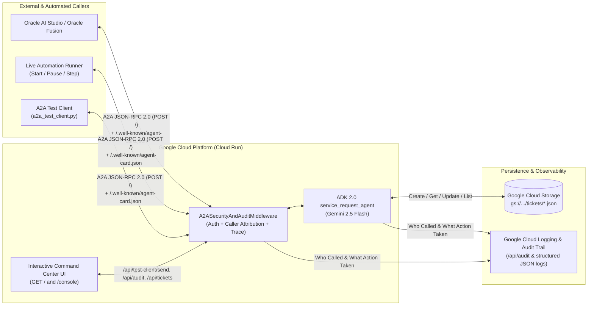

# Service Request A2A Agent (`service-request-a2a-agent`)

An enterprise-ready **Agent-to-Agent (A2A)** server built with the **Google Agent Development Kit (ADK 2.0)** and **Google Cloud Storage (GCS)**, featuring **Real-Time Security & Action Auditing**, an **Interactive Web Command Center**, and a **Start/Pause Live Multi-Agent Automation Runner**.

> [!IMPORTANT]
> **Oracle AI World & Fusion Hackathon Participants / Organizers:**
> See the complete step-by-step **[Oracle Hackathon Integration & Participant Guide (`ORACLE_HACKATHON_GUIDE.md`)](./ORACLE_HACKATHON_GUIDE.md)** for live connection URLs, Oracle AI Studio setup instructions, sample prompts, `curl`/Python snippets, and official ADK/A2A/MCP references.

---

## 1. Architecture Overview



---

## 2. Key Capabilities

1. **Full Caller & Action Auditing (`audit.py`)**:
   - Tracks **who/what called** the A2A server (`caller_id`, `caller_role`, `caller_ip`, `user_agent`, `trace_id`, `auth_status`) and **what action it took** (`create_trouble_ticket`, `get_ticket_status`, `update_ticket_status`, `list_trouble_tickets`, affected `ticket_id`, and `latency_ms`).
   - Emits structured JSON entries with `logging.googleapis.com/labels` directly to **Google Cloud Logging** and exposes real-time telemetry at `GET /api/audit`.
2. **Inbound Security Enforcement (`main.py`)**:
   - Supports `X-API-KEY` and `Authorization: Bearer <token>` validation.
   - Automatically blocks and audits unauthorized / invalid token attempts (`SECURITY_BLOCK` with HTTP `401`) so security monitoring can be demonstrated live.
3. **Interactive A2A Command Center (`static/index.html` served at `/` and `/console`)**:
   - **Live Automation Runner**: Click **▶ Start Live Automation** to watch simulated multi-agent personas (`oracle-adb-health-monitor`, `oracle-ai-studio-agent`, `oracle-fusion-scm-workflow`, `unverified-external-bot`, `l3-cloud-ops-responder`) execute real A2A calls against the server, and click **⏸ Pause Automation** anytime to stop.
   - **Interactive A2A Playground & Wire Inspector**: Send custom natural-language prompts or 1-click scenarios as any caller persona and inspect the raw A2A JSON-RPC 2.0 request/response payloads.
   - **Live Audit Trail & GCS Trouble Tickets Board**: Watch audit logs and GCS tickets update in real time.
4. **Standalone CLI & Programmatic Test Agent (`a2a_test_client.py`)**:
   - Run `python a2a_test_client.py --url <CLOUD_RUN_URL>` from your terminal to execute an end-to-end A2A discovery, ticket creation, ticket listing, and security block verification suite.

---

## 3. Project Structure

```text
service-request-a2a-agent/
├── agent.py             # ADK 2.0 Root Agent & GCS/local trouble-ticket tools with audit hooks
├── audit.py             # Security, caller attribution & action auditing engine (Cloud Logging + API)
├── main.py              # A2A ASGI server entry point, security middleware & telemetry routes
├── a2a_test_client.py   # Standalone A2A JSON-RPC test agent & CLI verification suite
├── static/
│   └── index.html       # Interactive A2A Command Center & Start/Pause Automation UI
├── agent_card.json      # Reference A2A Agent Card payload for Oracle registration
├── deploy.sh            # One-command Cloud Run & GCS deployment script
├── Dockerfile           # Python 3.12-slim container image for Cloud Run
├── requirements.txt     # Runtime dependencies
├── pyproject.toml       # Project metadata & pytest configuration
└── tests/
    └── test_agent.py    # Unit tests for ticket tools, audit logging & A2A parsing
```

---

## 4. Deploy & Test on Google Cloud Run

```bash
chmod +x deploy.sh
./deploy.sh
```

Run the standalone CLI test agent against your deployed Cloud Run URL:

```bash
python3 a2a_test_client.py --url "https://service-request-a2a-agent-750496483448.us-central1.run.app"
```
