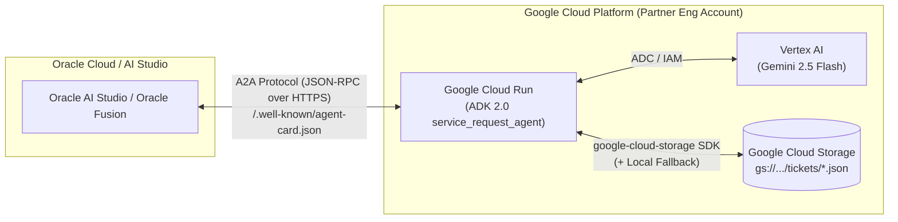

# Service Request A2A Agent (`service-request-a2a-agent`)

An enterprise-ready **Agent-to-Agent (A2A)** server built with the **Google Agent Development Kit (ADK 2.0)** and **Google Cloud Storage (GCS)**, designed to run on **Google Cloud Run** and interoperate with **Oracle AI Studio** and **Oracle Fusion** workflows.

---

## 1. Architecture Overview



### Key Improvements Over Initial Notebook Blueprint
1. **ADK 2.0 & A2A Protocol Compatibility (`google-adk[a2a]>=2.0.0`)**:
   - Upgraded from legacy `google-adk>=0.4.0` to `google-adk[a2a]>=2.0.0`.
   - Serves both `/.well-known/agent-card.json` (A2A v0.3 / v1.0) and `/.well-known/agent.json` (legacy discovery) and strips redundant `:443` ports from advertised Cloud Run HTTPS URLs.
2. **Vertex AI Environment Configuration on Cloud Run**:
   - Explicitly configures `GOOGLE_GENAI_USE_VERTEXAI=true`, `GOOGLE_CLOUD_PROJECT`, and `GOOGLE_CLOUD_LOCATION` on Cloud Run and enables `aiplatform.googleapis.com` so the container authenticates seamlessly via Application Default Credentials (ADC).
3. **Safe Cloud Run Environment Variable Updates**:
   - Uses `gcloud run services update --update-env-vars="CLOUD_RUN_URL=..."` instead of `--set-env-vars` so setting the self-reported `CLOUD_RUN_URL` does not wipe out `GCS_BUCKET_NAME` and `GEMINI_MODEL`.
   - Deploys directly from source (`gcloud run deploy --source .`) via Artifact Registry rather than deprecated `gcr.io`.
4. **Expanded ServiceNow-Style Toolset & Stateful Local Fallback**:
   - Collision-safe UTC ticket IDs (`REQ-YYYYMMDDHHMMSS-XXXX`) using `datetime.now(timezone.utc)`.
   - Four tools: `create_trouble_ticket`, `get_ticket_status`, `update_ticket_status`, and `list_trouble_tickets`.
   - Automatic local fallback (`/tmp/service_request_tickets`) when GCS is unconfigured or unreachable, ensuring full stateful behavior during local development and demos.
5. **Optional Inbound Security (`X-API-KEY` / `Bearer` Token)**:
   - Unauthenticated by default for rapid hackathon onboarding, or locked down with `X-API-KEY` / `Authorization: Bearer <token>` simply by setting the `A2A_API_KEY` environment variable (while keeping `/health` and `/.well-known/*` discovery endpoints public).

---

## 2. Project Structure

```text
service-request-a2a-agent/
├── agent.py             # ADK 2.0 Root Agent & GCS/local trouble-ticket tools
├── main.py              # A2A ASGI server entry point (to_a2a + auth/compat middleware)
├── agent_card.json      # Reference A2A Agent Card payload for Oracle registration
├── deploy.sh            # One-command Cloud Run & GCS deployment script
├── Dockerfile           # Python 3.12-slim container image for Cloud Run
├── requirements.txt     # Pinned runtime dependencies
├── pyproject.toml       # Project metadata & pytest configuration
├── .env.example         # Local environment variable template
└── tests/
    └── test_agent.py    # Unit tests for ticket tools & endpoint configuration
```

---

## 3. Local Quick Start

```bash
# 1. Create and activate virtual environment
python3 -m venv .venv
.venv/bin/pip install -r requirements.txt

# 2. Configure environment variables
cp .env.example .env
# Edit .env with your GOOGLE_CLOUD_PROJECT (or GEMINI_API_KEY)

# 3. Run the A2A server locally on http://localhost:8080
.venv/bin/python main.py
```

Verify the local endpoints in another terminal:

```bash
# Health check
curl -s http://localhost:8080/health | jq .

# A2A Agent Card discovery
curl -s http://localhost:8080/.well-known/agent-card.json | jq .
```

---

## 4. Deploy to Google Cloud Run

Run the automated deployment script ([`deploy.sh`](file:///usr/local/google/home/anwarbelayachi/Dev/service-request-a2a-agent/deploy.sh)):

```bash
export PROJECT_ID="your-partner-eng-gcp-project"
export REGION="us-central1"
export BUCKET_NAME="${PROJECT_ID}-oracle-hackathon-tickets"

chmod +x deploy.sh
./deploy.sh
```

### Enable Optional API Key Security for Oracle Fusion

If Oracle AI Studio / Oracle Fusion requires a shared secret header (`X-API-KEY` or `Authorization: Bearer <token>`):

```bash
gcloud run services update service-request-a2a-agent \
  --region="${REGION}" \
  --update-env-vars="A2A_API_KEY=your-shared-hackathon-secret"
```
